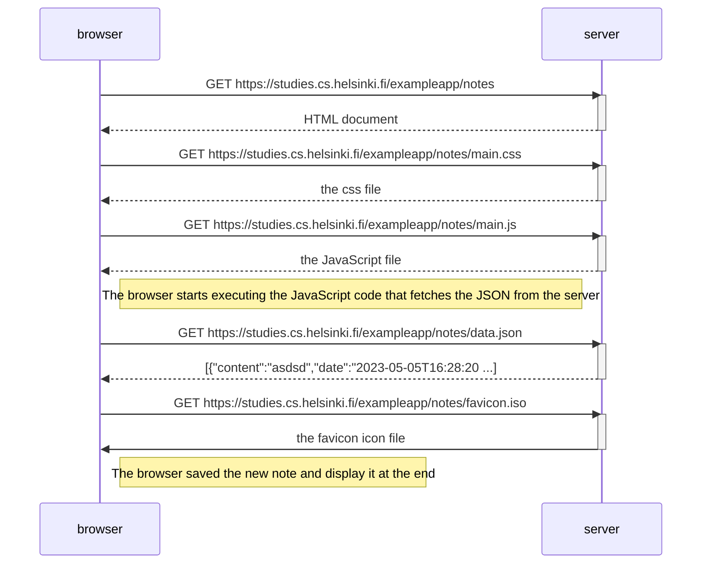

```mermaid

sequenceDiagram
    participant browser
    participant server

    browser->>server: GET https://studies.cs.helsinki.fi/exampleapp/notes
    activate server
    server-->>browser: HTML document
    deactivate server

    browser->>server: GET https://studies.cs.helsinki.fi/exampleapp/notes/main.css
    activate server
    server-->>browser: the css file
    deactivate server

    browser->>server: GET https://studies.cs.helsinki.fi/exampleapp/notes/main.js
    activate server
    server-->>browser: the JavaScript file
    deactivate server

    Note right of browser: The browser starts executing the JavaScript code that fetches the JSON from the server

    browser->>server: GET https://studies.cs.helsinki.fi/exampleapp/notes/data.json
    activate server
    server-->>browser:[{"content":"asdsd","date":"2023-05-05T16:28:20 ...]
    deactivate server

    browser->>server: GET https://studies.cs.helsinki.fi/exampleapp/notes/favicon.iso
    activate server
    server->>browser: the favicon icon file
    deactivate server

   Note right of browser: The browser saved the new note and display it at the end
```
